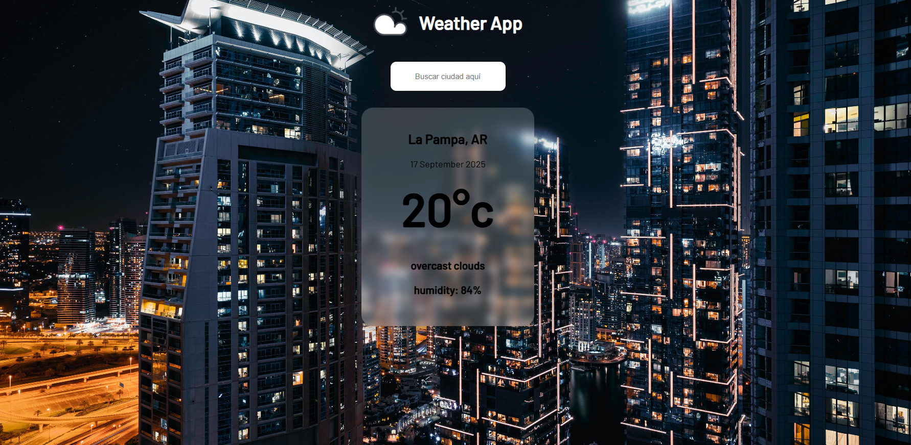
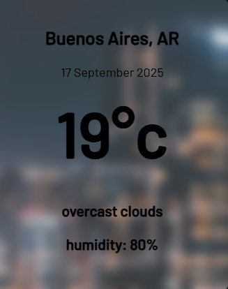

# <h1 align="center">Weather app</h1>

Aplicación web que muestra el clima actual de cualquier ciudad del mundo en tiempo real.
Fue desarrollado con **HTML, CSS y Javascript**, obteniendo la información mediante una **API del clima**. 

## Funcionamiento
1. En el campo de busqueda que dice **Buscar ciudad**, escribe el nombre de la ciudad deseada.
2. Presiona la tecla **Enter**.
3. Automáticamente te mostrará la información del clima para esa ciudad, incluyendo:
    - Temperatura Actual.
    - Ciudad y País.
    - Estado del cielo.
    - Humedad relativa.

## Tecnologías utilizadas

- **HTML5** -> estructura de la aplicación.
- **CSS3** -> Diseño y estilos responsivos.
- **Javascript** -> Lógica, consumo de la API y actualización dinamica de la interfaz.
- **API OpenWeatherMap** -> Fuente de datos meteorologicos.

